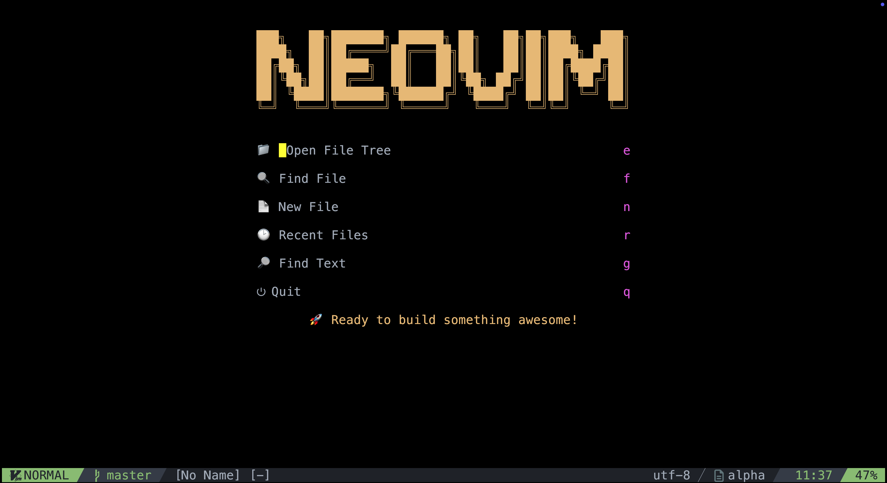
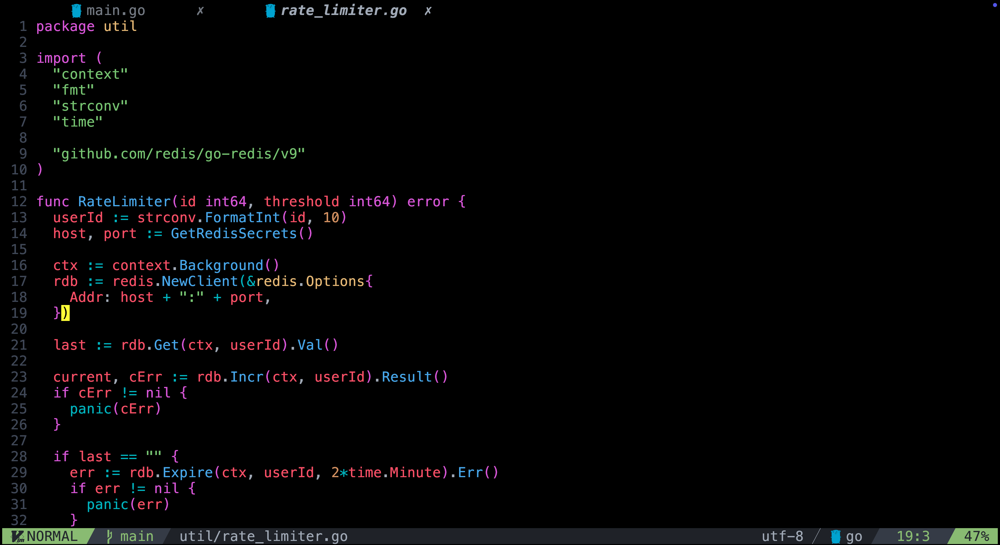
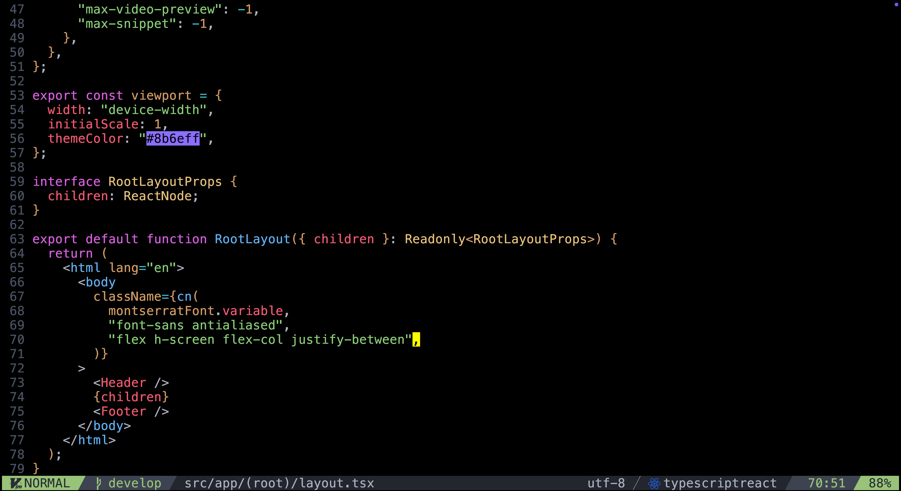

# My Neovim Configuration

My personal sleek, modern, and feature-rich Neovim configuration built with Lua and powered by [lazy.nvim](https://github.com/folke/lazy.nvim).

## Screenshots





## Requirements

- **Neovim** >= 0.9.0
- **Git**
- **Node.js**
- **ripgrep**
- **fd** or **find**
- A **Nerd Font**

### macOS Installation
```bash
# Install Neovim
brew install neovim

# Install dependencies
brew install ripgrep fd git node

# Install a Nerd Font
brew install --cask font-fira-code-nerd-font
```

### Linux Installation
```bash
# Ubuntu/Debian
sudo apt update
sudo apt install neovim ripgrep fd-find git nodejs npm

# Arch Linux
sudo pacman -S neovim ripgrep fd git nodejs npm
```

## Installation

1. **Backup your existing Neovim configuration** (if you have one):
   ```bash
   mv ~/.config/nvim ~/.config/nvim.backup
   ```

2. **Clone my configuration**:
   ```bash
   git clone https://github.com/alipiry/nvim.git ~/.config/nvim
   ```

3. **Start Neovim**:
   ```bash
   nvim
   ```

4. **Wait for plugins to install** - Lazy.nvim will automatically install all plugins on first launch.

## Key Bindings

### General
| Key | Action |
|-----|--------|
| `<Space>` | Leader key |
| `<C-s>` | Save file |
| `<leader>sn` | Save file without formatting |
| `<C-q>` | Quit current buffer |
| `<C-z>` | Quit Neovim |
| `<leader>x` | Close current buffer |
| `;` | Enter command mode |

### Navigation
| Key | Action |
|-----|--------|
| `<C-h>` | Move to left pane |
| `<C-j>` | Move to below pane |
| `<C-k>` | Move to upper pane |
| `<C-l>` | Move to right pane |
| `<C-d>` | Scroll down and center |
| `<C-u>` | Scroll up and center |
| `n` | Find next and center |
| `N` | Find previous and center |

### Window Management
| Key | Action |
|-----|--------|
| `<leader>v` | Split window vertically |
| `<leader>h` | Split window horizontally |
| `<leader>se` | Make windows equal width |

### File Explorer (Neo-tree)
| Key | Action |
|-----|--------|
| `<C-n>` | Toggle Neo-tree sidebar |

### File Navigation (Telescope)
| Key | Action |
|-----|--------|
| `<leader>ff` | Find files |
| `<leader>fw` | Live grep (search in files) |
| `<leader>fb` | Browse buffers |
| `<leader>fh` | Help tags |

### Buffer Management
| Key | Action |
|-----|--------|
| `<Tab>` | Next buffer |
| `<S-Tab>` | Previous buffer |
| `<leader>bd` | Delete buffer |
| `<leader>bn` | New buffer |
| `<leader>bp` | Pin/unpin buffer |

### LSP (Language Server Protocol)
| Key | Action |
|-----|--------|
| `gd` | Go to definition (Telescope) |
| `gr` | Go to references (Telescope) |
| `gi` | Go to implementation (Telescope) |
| `gD` | Go to definition (builtin LSP) |
| `gR` | Go to references (builtin LSP) |
| `gI` | Go to implementation (builtin LSP) |
| `K` | Hover documentation |

### Trouble (Diagnostics)
| Key | Action |
|-----|--------|
| `<leader>t` | Toggle diagnostics |
| `<leader>tx` | Toggle buffer diagnostics |
| `<leader>ts` | Toggle symbols |
| `<leader>td` | Toggle LSP definitions/references |
| `<leader>tl` | Toggle location list |
| `<leader>tf` | Toggle quickfix list |

### Flash (Quick Navigation)
| Key | Action |
|-----|--------|
| `s` | Flash jump |
| `S` | Flash treesitter |
| `r` | Flash remote (operator mode) |
| `R` | Flash treesitter search |

### Completion (Blink.cmp)
| Key | Action |
|-----|--------|
| `<C-p>` | Show completion menu |
| `<Tab>` | Select next completion |
| `<S-Tab>` | Select previous completion |
| `<CR>` | Accept completion |
| `<Up>` | Select previous completion |
| `<Down>` | Select next completion |

### Terminal (ToggleTerm)
| Key | Action |
|-----|--------|
| `<C-\>` | Toggle floating terminal |

### Git (Lazygit)
| Key | Action |
|-----|--------|
| `<leader>gg` | Toggle Lazygit |

### Copilot Chat
| Key | Action | Mode |
|-----|--------|------|
| `<leader>cc` | Toggle Copilot Chat | Normal |
| `<leader>cr` | Reset Copilot Chat | Normal |
| `<leader>ce` | Explain code | Visual |
| `<leader>cf` | Fix code (visual) / Analyze current file (normal) | Visual/Normal |
| `<leader>co` | Optimize code | Visual |
| `<leader>cr` | Refactor code | Visual |
| `<leader>cq` | Quick chat | Normal |
| `<leader>cp` | Ask about current file | Normal |
| `<leader>cw` | Ask about workspace | Normal |
| `<leader>cm` | Model selection | Normal |

### Linting
| Key | Action |
|-----|--------|
| `<leader>l` | Trigger linting for current file |

### Treesitter Text Objects
| Key | Action | Mode |
|-----|--------|------|
| `af` | Select function | Visual/Operator |
| `aa` | Select parameter | Visual/Operator |
| `ab` | Select block | Visual/Operator |
| `a` | Select assignment | Visual/Operator |
| `<leader>a` | Swap next parameter | Normal |
| `<leader>A` | Swap previous parameter | Normal |

### Text Editing
| Key | Action | Mode |
|-----|--------|------|
| `p` | Paste from last yanked text | Visual |

## 🔧 Configuration Structure

```
~/.config/nvim/
├── init.lua                    # Main configuration file
├── lazy-lock.json             # Plugin version lock file
├── lua/
│   ├── core/
│   │   ├── keymaps.lua        # Key mappings
│   │   └── options.lua        # Neovim options
│   └── plugins/
│       ├── init.lua           # Plugin loader
│       ├── alpha.lua          # Start screen
│       ├── autopairs.lua      # Auto pairs
│       ├── autotag.lua        # Auto tag closing
│       ├── blink.lua          # Completion engine (blink.cmp)
│       ├── bufferline.lua     # Buffer tabs
│       ├── colorizer.lua      # Color highlighting
│       ├── comment.lua        # Commenting
│       ├── conform.lua        # Formatting
│       ├── copilot.lua        # GitHub Copilot
│       ├── copilot-chat.lua   # Copilot Chat
│       ├── devicons.lua       # File icons
│       ├── early-retirement.lua # Plugin management
│       ├── flash.lua          # Fast navigation
│       ├── gitsigns.lua       # Git integration
│       ├── indent-blankline.lua # Indent guides
│       ├── lazygit.lua        # Git TUI integration
│       ├── lsp.lua            # LSP configuration
│       ├── lspkind.lua        # LSP completion icons
│       ├── lualine.lua        # Status line
│       ├── luasnip.lua        # Snippet engine
│       ├── mason.lua          # LSP server manager
│       ├── mason-tool-installer.lua # Mason tool installer
│       ├── neotree.lua        # File explorer
│       ├── noice.lua          # UI improvements
│       ├── signature.lua      # Function signature help
│       ├── surround.lua       # Text objects surrounding
│       ├── telescope.lua      # Fuzzy finder
│       ├── theme.lua          # Color scheme
│       ├── toggleterm.lua     # Terminal
│       ├── treesitter.lua     # Syntax highlighting
│       ├── trouble.lua        # Diagnostics
│       ├── ts-comments.lua    # Better commenting
│       └── whichkey.lua       # Key helper
└── README.md                  # This file
```

## Customization

### Changing the Theme
Edit `lua/plugins/theme.lua` to use a different colorscheme:
```lua
return {
  "your-preferred/colorscheme",
  lazy = false,
  config = function()
    vim.cmd "colorscheme your-colorscheme"
  end,
}
```

### Adding New Plugins
Add new plugins to `lua/plugins/` directory. Each plugin should be in its own file and return a lazy.nvim plugin specification.

### Modifying Key Bindings
Edit `lua/core/keymaps.lua` to customize key mappings or add new ones.

### Adjusting Options
Modify `lua/core/options.lua` to change Neovim settings like tab size, line numbers, etc.


## License

This configuration is available under the [Unlicense License](LICENSE).

## Acknowledgments

Thanks to the amazing Neovim community and all the plugin authors who make my configuration possible!

---

**Happy coding with Neovim!**
